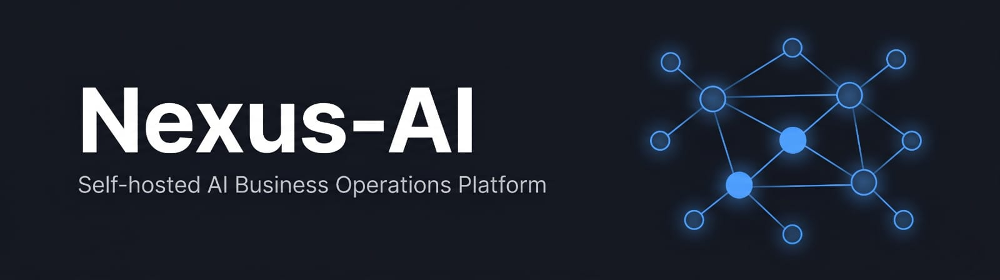
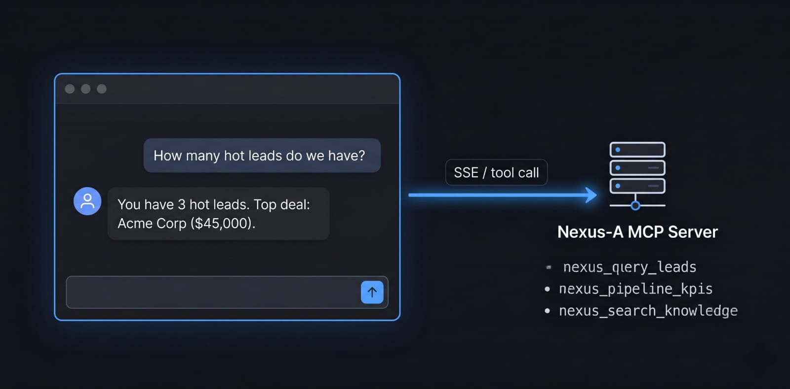
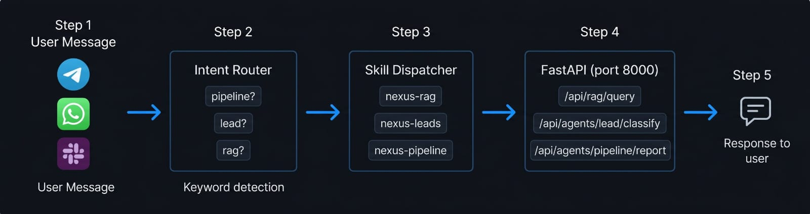

# Nexus-AI

> Self-hosted AI business operations platform — RAG · LangGraph Agents · MCP · Messaging · Automation · Dashboard

<p align="center">
  
</p>

<p align="center">
  
  
  
  
  
  
  
  
</p>

---

## What It Does

Nexus-AI is a production-quality, fully self-hosted platform that brings AI into the complete lifecycle of a B2B sales pipeline. It combines a RAG knowledge engine that ingests any document and answers with cited sources, three LangGraph agents for lead classification, follow-up generation, and pipeline reporting, an MCP server that lets Claude Desktop query the live database in plain English, and a messaging gateway that routes Telegram, WhatsApp, and Slack conversations to the same AI backend. Everything deploys with a single `docker-compose up -d` and runs on local hardware — your data never leaves the machine.

---

## Architecture

<p align="center">
  
</p>

---

## Features

**🔍 RAG Knowledge Engine**
Ingest any PDF, DOCX, Markdown file, or URL. Queries use hybrid semantic + BM25 retrieval followed by CrossEncoder reranking, so answers are grounded in your actual documents and cite their sources. The knowledge base is queryable from the dashboard, via Claude Desktop, via any messaging channel, or directly from the API.

**🤖 LangGraph AI Agents**
Three production agents built with LangGraph StateGraph and a SQLite checkpointer. The Lead Classifier runs 5 reasoning nodes to score leads 0–100 and route them to the correct pipeline stage. The Follow-up Writer generates personalised deal emails and self-reviews its own draft, retrying if quality is below threshold. The Pipeline Reporter computes conversion rates, deal age, stage distribution, and bottleneck detection — then writes an executive digest.

**🔌 MCP + Claude Desktop**
Ten tools exposed via FastMCP over SSE transport. Connect Claude Desktop and ask "How many hot leads do we have?" or "Draft a follow-up for deal [id]" — Claude calls the live SQLite database and LangGraph agents in real time. Any MCP-compatible AI assistant can query the business without writing SQL.

**⚡ Multi-Channel Automation**
The same AI backend responds across Telegram, WhatsApp, Slack, and n8n webhooks. OpenClaw gateway uses keyword-based intent routing (zero LLM cost) to dispatch each message to the right skill. Four n8n workflows handle lead intake, stale-deal follow-up scheduling, Monday pipeline digests, and critical alert escalation — all on cron or webhook triggers.

---

## Tech Stack

| Backend | Frontend & Automation |
|---|---|
| Python 3.12 · FastAPI · Pydantic v2 | React 18 · Vite 5 · TypeScript · TailwindCSS |
| LangGraph 1.x · LangChain 1.x | Node.js 22 (OpenClaw gateway) |
| ChromaDB 0.6.3 · BM25 · CrossEncoder | n8n (4 automation workflows) |
| Ollama · OpenAI · Claude · Gemini | Telegram Bot API · Twilio WhatsApp · Slack Bolt |
| SQLite (WAL · aiosqlite) | FastMCP · SSE transport |
| Docker Compose (6 services) | Vite proxy → FastAPI |

---

## Quick Start

### Prerequisites

- WSL2 with Docker and `docker-compose` installed
- Ollama running on Windows host (`set OLLAMA_HOST=0.0.0.0 && ollama serve`)
  - Pull required models: `ollama pull nomic-embed-text` and `ollama pull gemma3:4b`
- At least one LLM API key (Gemini / Anthropic / OpenAI) — or use Ollama only for full privacy

### Setup

```bash
git clone https://github.com/AbdelRahman-Madboly/Nexus-AI.git
cd Nexus-AI
cp .env.example .env

# Edit .env — set OLLAMA_BASE_URL to your Windows host IP, add API key(s)
# Get host IP: ip route | grep default | awk '{print $3}'

docker-compose up -d
# First start takes 60-90s — ChromaDB initialises, CrossEncoder model loads from cache

curl http://localhost:8000/api/health
# → {"status":"ok","components":{"database":{"status":"ok"},...}}
```

### Ingest a document and ask a question

```bash
# Ingest a URL
curl -X POST http://localhost:8000/api/rag/ingest \
  -H "Content-Type: application/json" \
  -d '{"source": "https://your-docs-url.com"}'

# Ask a question
curl -X POST http://localhost:8000/api/rag/query \
  -H "Content-Type: application/json" \
  -d '{"query": "What does this product do?", "top_k": 3}'
```

### Services

| Service | URL | Purpose |
|---|---|---|
| Dashboard | http://localhost:3000 | React UI — RagChat, AgentTracer, Pipeline |
| FastAPI | http://localhost:8000 | AI backend — all agent and RAG logic |
| API Docs | http://localhost:8000/api/docs | Swagger UI |
| n8n | http://localhost:5678 | Workflow automation |
| ChromaDB | http://localhost:8001 | Vector store |
| OpenClaw | http://localhost:3456 | Messaging gateway |

---

## LLM Configuration

Switch backends with a single `.env` change — no code changes required.

```bash
LLM_BACKEND=gemini          # gemini | claude | openai | ollama
PRIVACY_MODE=false           # true → all calls go to Ollama, no exceptions

GEMINI_API_KEY=your-key
ANTHROPIC_API_KEY=sk-ant-...
OPENAI_API_KEY=sk-...
OLLAMA_BASE_URL=http://172.29.208.1:11434   # Windows host IP (check after reboot)
OLLAMA_MODEL=gemma3:4b
```

Embeddings always use Ollama `nomic-embed-text` regardless of LLM backend — this keeps ChromaDB vectors consistent across ingest and query sessions.

---

## Claude Desktop Integration (MCP)

<p align="center">
  
</p>

Add to your Claude Desktop config (`%APPDATA%\Claude\claude_desktop_config.json` on Windows):

```json
{
  "mcpServers": {
    "nexus-ai": {
      "url": "http://localhost:8000/mcp/sse",
      "name": "Nexus-AI",
      "description": "AI CRM — leads, deals, knowledge base, pipeline agents"
    }
  }
}
```

Then ask Claude: "How many hot leads do we have?" or "Generate a pipeline KPI report."

10 tools available: `nexus_query_leads` · `nexus_query_deals` · `nexus_get_deal_history` · `nexus_update_deal_stage` · `nexus_search_knowledge` · `nexus_ingest_document` · `nexus_draft_email` · `nexus_schedule_followup` · `nexus_pipeline_kpis` · `nexus_agent_runs`

---

## Messaging Gateway (OpenClaw)

<p align="center">
  
</p>

Connect Telegram, WhatsApp, or Slack without touching the dashboard.

| Message | Routed to |
|---|---|
| "what is...", "tell me about...", anything unknown | RAG knowledge base |
| "classify lead...", "new lead from..." | Lead Classifier Agent |
| "followup for deal [uuid]" | Follow-up Writer Agent |
| "pipeline report", "kpis", "conversion" | Pipeline Reporter Agent |

---

## n8n Automation Workflows

Four ready-to-import workflow JSON files in `n8n/workflows/`:

| Workflow | Trigger | What it does |
|---|---|---|
| `lead-intake.json` | Webhook | Classifies incoming lead → Slack notification |
| `followup-scheduler.json` | Daily 9 AM | Finds stale deals → drafts follow-up → Gmail |
| `pipeline-digest.json` | Monday 8 AM | Pipeline report → email + Slack |
| `alert-escalation.json` | Webhook | WhatsApp + Slack alert → 4h wait → escalate |

Import via n8n UI at `http://localhost:5678`.

---

## Project Structure

```
Nexus-AI/
├── api/
│   ├── config.py           — pydantic-settings singleton, PRIVACY_MODE enforcement
│   ├── database.py         — SQLite WAL, 4 tables
│   ├── main.py             — FastAPI app, lifespan, MCP mount
│   ├── llm/                — LLM router + 4 backend clients
│   ├── rag/                — Document ingestor + hybrid retriever
│   ├── agents/             — 3 LangGraph agents + shared utilities
│   ├── mcp/                — FastMCP server, 10 tools, SSE transport
│   └── routers/            — rag_router · agent_router · mcp_router
├── openclaw/
│   ├── index.js            — Gateway: Telegram + WhatsApp + Slack + intent router
│   └── skills/             — nexus-rag · nexus-leads · nexus-pipeline
├── n8n/workflows/          — 4 n8n workflow JSON files
├── dashboard/              — React 18 + Vite + TypeScript + TailwindCSS
├── tests/                  — 35 tests across 5 suites
├── docs/                   — architecture · api_contract · demo_script
└── docker-compose.yml      — 6 services, single-command deploy
```

---

## Configuration Reference

| Variable | Description | Example |
|---|---|---|
| `LLM_BACKEND` | Active LLM provider | `gemini` |
| `PRIVACY_MODE` | Route all calls to Ollama | `false` |
| `OLLAMA_BASE_URL` | Windows host Ollama URL (changes on reboot) | `http://172.29.208.1:11434` |
| `OLLAMA_MODEL` | Chat model for Ollama backend | `gemma3:4b` |
| `OLLAMA_EMBED_MODEL` | Embedding model (always Ollama) | `nomic-embed-text` |
| `GEMINI_API_KEY` | Google Gemini API key | `AIza...` |
| `ANTHROPIC_API_KEY` | Anthropic Claude API key | `sk-ant-...` |
| `OPENAI_API_KEY` | OpenAI API key | `sk-...` |
| `CHROMA_HOST` | ChromaDB hostname (Docker internal) | `nexus-chroma` |
| `CHROMA_PORT` | ChromaDB port (Docker internal) | `8000` |
| `DATABASE_URL` | SQLite path | `sqlite:///./nexus.db` |
| `TELEGRAM_BOT_TOKEN` | Telegram bot token | `8718...` |
| `SLACK_BOT_TOKEN` | Slack bot OAuth token | `xoxb-...` |
| `SLACK_APP_TOKEN` | Slack Socket Mode token | `xapp-...` |
| `TWILIO_ACCOUNT_SID` | Twilio account SID | `AC...` |
| `TWILIO_AUTH_TOKEN` | Twilio auth token | `...` |

---

## Test Coverage

```bash
python -m pytest tests/ -v
```

| Suite | Tests | Status |
|---|---|---|
| `test_database.py` | 18 | ✅ Passing |
| `test_rag.py` | 10 | ✅ Passing |
| `test_agents.py` | 7 | ✅ Passing |
| `test_mcp.py` | 6 | ✅ Passing |
| `test_openclaw_skills.js` | 5 | ✅ Passing (integration) |

All agent and MCP tests are fully mocked — no Ollama, Gemini, or ChromaDB required to run the Python suite.

---

## Troubleshooting

| Symptom | Fix |
|---|---|
| `docker compose` not found | Use `docker-compose` (hyphen) |
| Ollama unreachable from container | Check `OLLAMA_BASE_URL` — WSL2 gateway IP changes on reboot |
| Uvicorn hangs 3–5 min on first start | CrossEncoder model (~90MB) downloading. Wait once — cached forever after |
| ChromaDB `KeyError: '_type'` | Do not pass `metadata=` to `get_or_create_collection()` |
| Gemini 429 on test suite | Free tier = 5 req/min. Set `LLM_BACKEND=ollama` for bulk testing |
| `GraphRecursionError` in agent | Increment state counters inside node return dicts, not edge functions |
| Telegram `409 Conflict` | Two bot instances running — `pkill -f "node index.js"` then restart |
| RAG returns empty answer | No documents ingested yet — run `POST /api/rag/ingest` first |
| n8n webhook 404 | Workflow not activated — toggle the Activate switch in n8n UI |
| Claude Desktop no tools | Fully quit and relaunch Claude Desktop after config change |

---

## Contributing

This project is a portfolio demonstration. Issues and PRs are welcome.

---

## Licence

MIT — Copyright 2026 Abdel Rahman M. El-Saied

---

**Owner:** Abdel Rahman M. El-Saied
**GitHub:** [github.com/AbdelRahman-Madboly/Nexus-AI](https://github.com/AbdelRahman-Madboly/Nexus-AI)